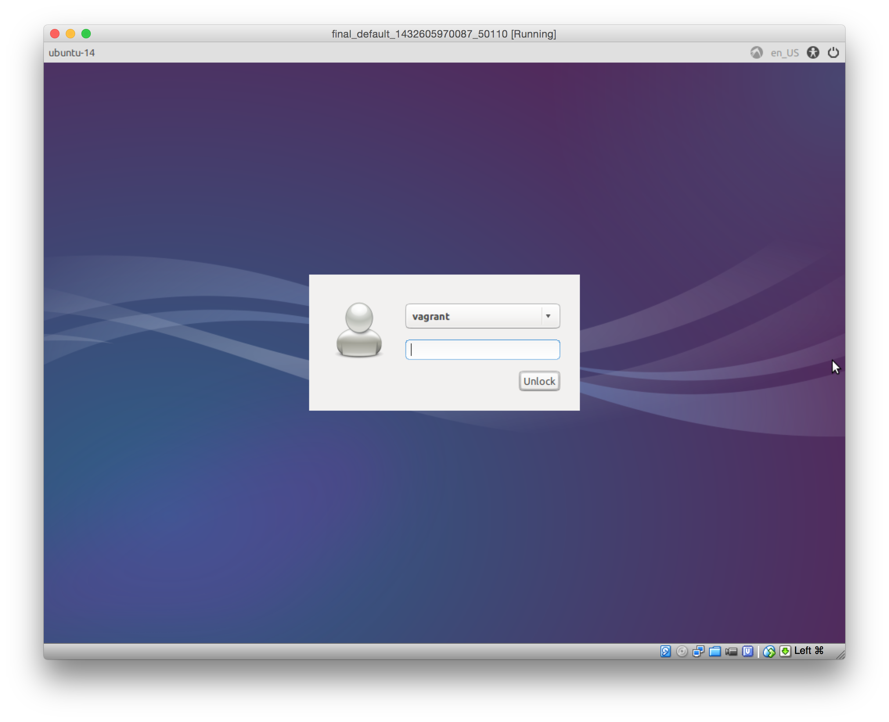
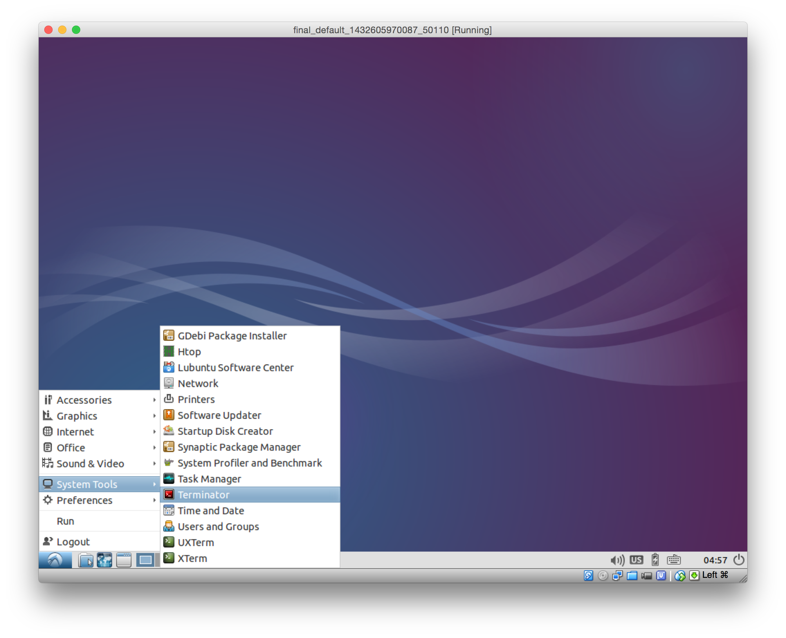
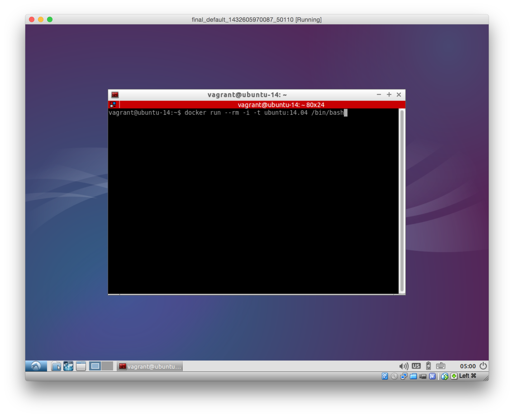
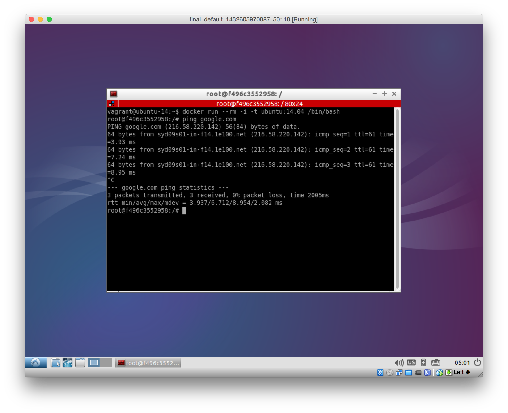
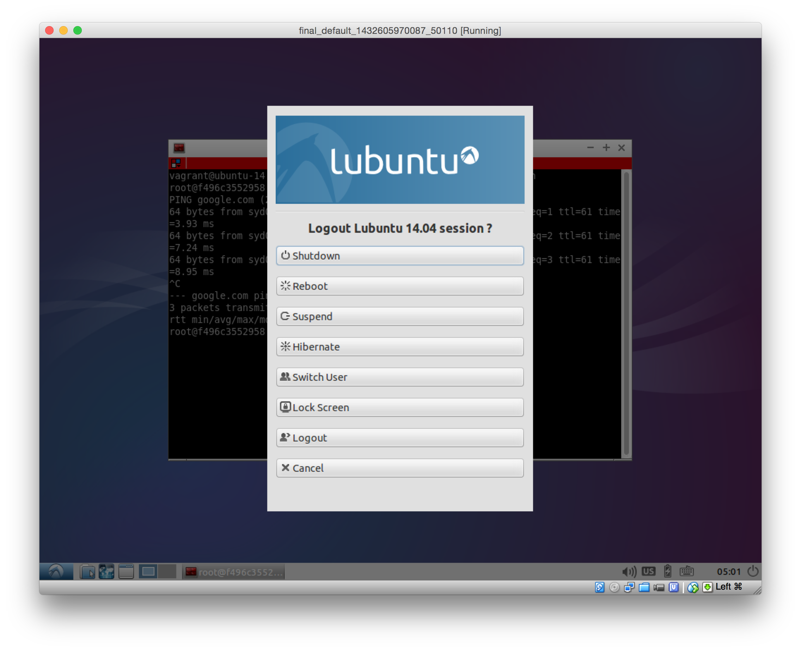

Docker playground
=================

Setup
-----

* [Install VirtualBox](https://www.virtualbox.org/wiki/Downloads)
* [Install Vagrant](http://docs.vagrantup.com/v2/installation/)
* [Install git](https://git-scm.com/book/en/v2/Getting-Started-Installing-Git)
* Get the content of this git repository:
 * `git clone https://github.com/DiUS/docker-env.git`
 * OR [download this ZIP](https://github.com/DiUS/docker-env/archive/master.zip)
   and extract it in a directory of your choice.
* In a shell run
    ```shell
    vagrant plugin install vagrant-vbguest
    ```
 * If this last step didn't work: don't worry... it's just nice to have.

Running the virtual box
----

1. open a shell
2. change into the directory you downloaded the git repository into (or unziped)
3. run `vagrant up`
 * It will download the box. This takes a while since the size is about 1.6 GB
 * If the process asks you for a password: **vagrant**
4. after successfull installation you should have a VirtualBox window like the following:

5. login with username: vagrant and password: vagrant
6. Open a shell (terminator):

7. in the shell enter `docker run --rm -i -t ubuntu:14.04 /bin/bash`:

8. inside the docker container enter `ping google.com`

9. If you see a line in your shell saying something like:
    ```
    PING google.com (216.58.220.142) 56(84) bytes of data.
    ```
  everything is setup well and you can shut down your box:
  
10. In the shell you startet the vagrant box from (for example in your Windows) you need to shut down your vagrant box. Otherwise it will keep running in the background:
    ```
    vagrant halt
    ```
